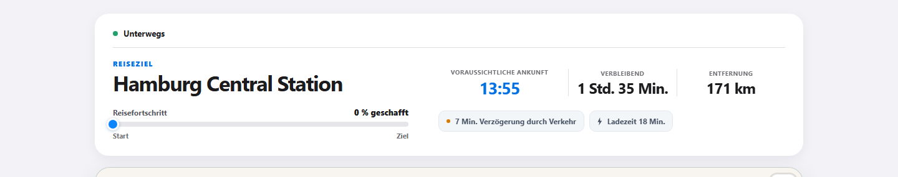

# Route Progress for Home Assistant

Route Progress is a custom Home Assistant integration for sharing the live progress of a journey through a temporary link. It sends only data from the Home Assistant entities you explicitly select.

## How sharing works

1. Press **Start share** in Home Assistant.
2. Route Progress immediately creates a unique, unguessable link that is valid for 24 hours.
3. Copy the link from Home Assistant and send it to friends, family, or anyone waiting for you. They do not need an account or an app.
4. The public, read-only page updates as the vehicle moves and shows the destination, route, driven track, ETA, remaining time and distance, traffic delay, charging time, and estimated battery level at arrival.
5. Press **Finish share** when needed. The frozen page remains readable until its normal 24-hour expiry.

The link is ready immediately, even while the service is still waiting for the journey to begin:

Once the trip is under way, the same link presents its live progress at a glance:

These screenshots were captured from a real, locally running Route Progress demo, not from a mock-up.

## Features

- Create a share link directly through a Home Assistant button entity
- Send position, destination, ETA, remaining distance, and optional route data
- Detect destination changes and accept them deliberately
- Finish a share manually at any time
- Expose connection and share status as Home Assistant entities
- Resume an active trip after a Home Assistant restart
- German and English user interface
- Configurable update interval from 10 to 300 seconds

This repository contains only the open-source Home Assistant integration. The Route Progress service is maintained separately and is not installed by this repository. Using the integration requires a service URL and credentials supplied by the service operator.

## Requirements

- Home Assistant with HACS, or support for manual custom-integration installation
- URL of a reachable Route Progress service
- API token issued for this Home Assistant instance
- Cloudflare Access client ID and client secret when required
- Suitable Home Assistant entities for the destination and vehicle position

## Installation with HACS

1. Use the **Open in HACS** badge above, or add https://github.com/madebylk/route-progress-ha to HACS as a custom repository of type **Integration**.
2. Install **Route Progress** in HACS.
3. Restart Home Assistant.
4. Open **Settings → Devices & services → Add integration** and search for **Route Progress**.

## Manual installation

Copy custom_components/route_progress to /config/custom_components/route_progress and restart Home Assistant. Updates must also be installed manually when using this method.

## Setup

First enter the service URL, API token, and an update interval between 10 and 300 seconds. Enable **Use Cloudflare Access** and enter the supplied client ID and client secret when required.

Then select data sources through Home Assistant entity selectors.

Required entities:

- Destination name
- Destination position with latitude and longitude attributes
- Vehicle position with latitude and longitude attributes

Optional entities:

- Heading
- Speed
- ETA as a timestamp or number of minutes
- Remaining distance
- Traffic delay
- Planned charging time
- Charging status
- Estimated battery level at arrival

## Usage

button.route_progress_start_share creates the unique 24-hour share link immediately. When the configured vehicle-position entity changes, the integration sends a complete snapshot of the selected route data after a short collection period. The configured interval also sends the complete current state as a heartbeat.

The service confirms a stable destination. If the destination later changes, the public route is frozen until the original destination returns or the new destination is accepted with button.route_progress_accept_destination. Use button.route_progress_finish_share to stop a share manually.

The integration reports navigation state neutrally as present, absent, or unknown. The service alone decides driver intent, destination confirmation, and the journey lifecycle.

| Entity | Purpose |
| --- | --- |
| sensor.route_progress_share_url | Current or most recently created share link |
| sensor.route_progress_share_status | Server-side share lifecycle status |
| binary_sensor.route_progress_active_share | Whether a share is active |
| binary_sensor.route_progress_cloud_connection | Service connection diagnostics |
| button.route_progress_start_share | Create a new share |
| button.route_progress_accept_destination | Accept a changed destination |
| button.route_progress_finish_share | Finish the active share |

Trip ID, status, and share link are stored locally in Home Assistant so an active share survives a restart. Credentials are never exposed as entity attributes.

## Privacy and security

- No share is created until the start button is pressed.
- Only values from explicitly configured entities are transmitted.
- The public link is read-only and expires after 24 hours.
- API and Cloudflare Access credentials stay in the Home Assistant config entry.
- Debug logs can contain state, route, and API data and should be enabled only temporarily.
- Share links and known credential fields are redacted from integration logs.

Do not report security vulnerabilities in a public issue. See [SECURITY.md](SECURITY.md).

## Troubleshooting

Enable debug logging temporarily:

~~~yaml
logger:
  logs:
    custom_components.route_progress: debug
~~~

Remove tokens, share links, entity names, and other personal information before sharing logs.

## Support and contributions

Use [GitHub Issues](https://github.com/madebylk/route-progress-ha/issues) for bug reports and feature requests. Check for an existing issue first.

See [CONTRIBUTING.md](CONTRIBUTING.md) for pull request guidelines.

## License

This project is available under the [MIT License](LICENSE).