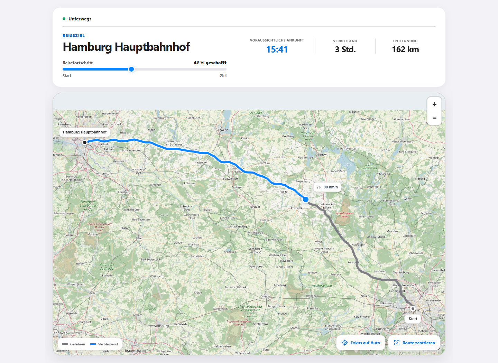
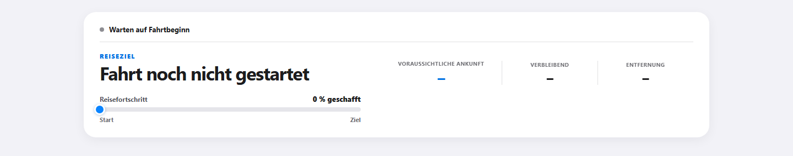
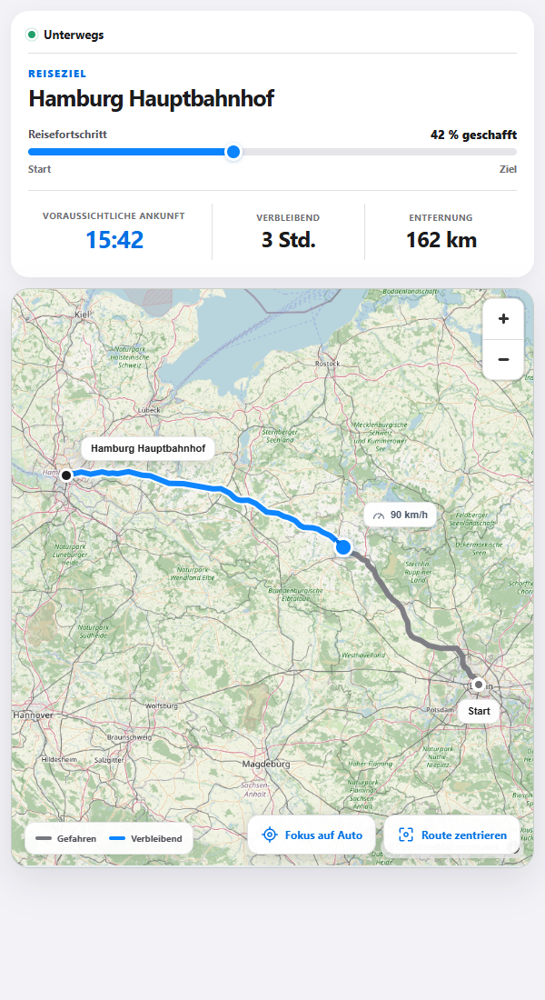
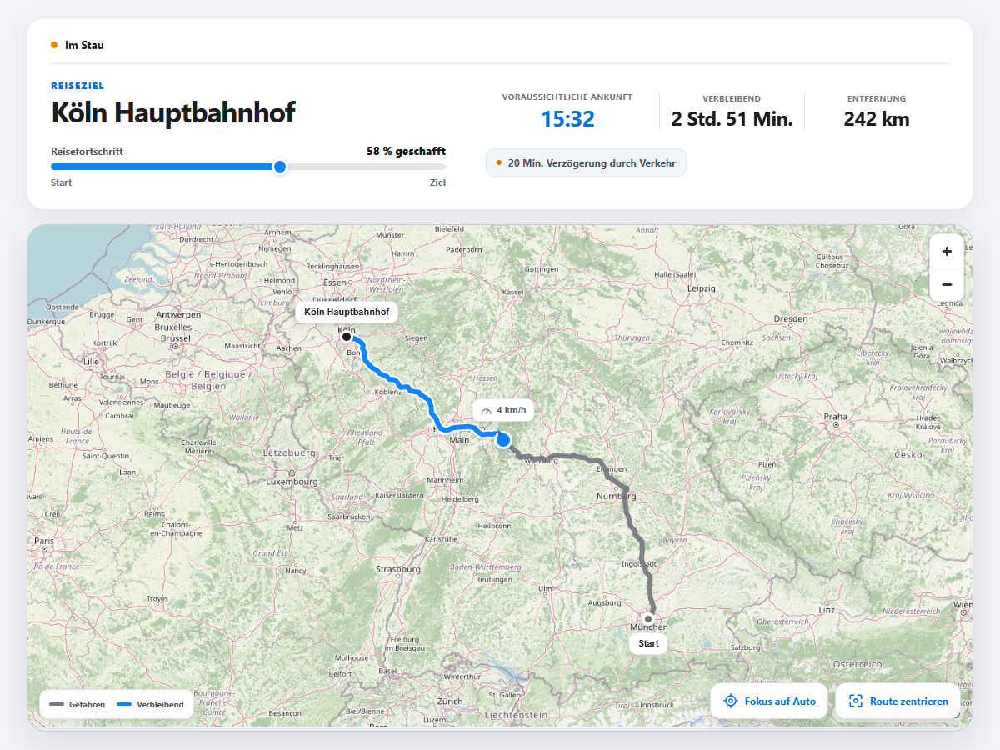
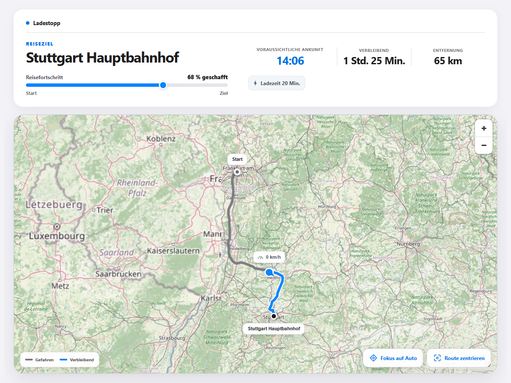
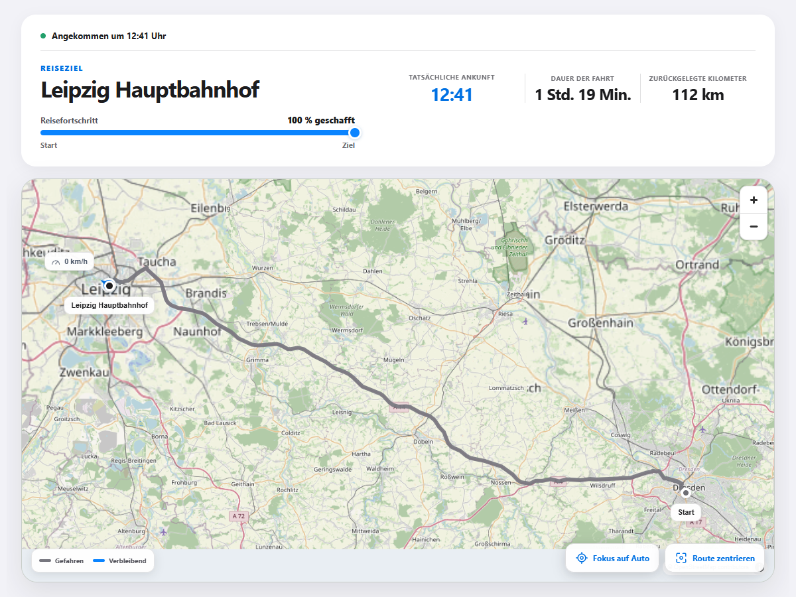

# Route Progress for Home Assistant

Route Progress turns Home Assistant journey data into a polished live page that you can share with friends and family. Recipients need no account and no app: one temporary, read-only link shows where the journey stands and what to expect next.

> [!IMPORTANT]
> **This integration requires a separate, non-public Route Progress server component.** This repository contains only the Home Assistant integration; the server source code is not publicly available and the server is not included in the HACS or manual installation. You need access to an existing server, its service URL, and credentials from its operator before you can use the integration. Installing this integration alone does not provide a working Route Progress service.

## How the components fit together

- **Home Assistant integration (this repository):** reads your selected entities, sends journey data to the server, and provides share controls and the resulting link in Home Assistant.
- **Route Progress server (non-public, required):** processes journey data, manages shares and their expiry, and serves the live pages shown in the screenshots below.
- **Shared page:** friends and family open the temporary link in their browser, without a Home Assistant account or app.

The screenshots show the server-hosted pages that become available when the integration is connected to that server.

The map makes progress immediately understandable: the driven section is grey, the remaining road route is blue, and the live vehicle marker sits between the start and destination. ETA, remaining time, distance, traffic delay, and charging time stay visible above the map.

## From one button to a live share

1. Press **Start share** in Home Assistant.
2. Route Progress immediately creates a unique, unguessable link that is valid for 24 hours.
3. Copy the link from Home Assistant and send it to friends, family, or anyone waiting for you.
4. The public page updates as the vehicle moves. It is read-only and never exposes Home Assistant access.
5. Press **Finish share** when needed. The completed page remains readable until its normal 24-hour expiry.

The share exists immediately, even before navigation and the first vehicle position arrive:

As soon as trip data arrives, the same link becomes the live map shown above. No new link needs to be sent.

## Built for every screen

The responsive layout keeps the complete journey useful on a phone: status, progress, ETA, distance, map, markers, legend, and map controls remain available without installing an app.

  

## More than a moving dot

Route Progress translates the incoming Home Assistant entities into clear journey states. Viewers can tell whether the vehicle is moving normally, delayed by traffic, stopped to charge, waiting to depart, or already at the destination.

| Traffic-aware progress | Charging stops |
| --- | --- |
| The status changes to **In traffic**, the delay is called out, and the driven and remaining route stay visible. | The page changes to **Charging stop** and shows the planned charging time alongside the live journey. |
|  |  |

## A useful record until the link expires

When the destination is reached, Route Progress presents the completed route, arrival time, total journey duration, and travelled distance. The frozen result remains available through the same link until its 24-hour expiry.

All screenshots above were captured from real, locally running Route Progress demo journeys using calculated road routes. They are not interface mock-ups.

## Features
- Create a share link directly through a Home Assistant button entity
- Send position, destination, ETA, remaining distance, and optional route data
- Detect destination changes and accept them deliberately
- Finish a share manually at any time
- Expose connection and share status as Home Assistant entities
- Resume an active trip after a Home Assistant restart
- German and English user interface
- Configurable update interval from 10 to 300 seconds

## Requirements

- Access to the **separate, non-public Route Progress server component**; this repository cannot be used to install or self-host that server
- Home Assistant with HACS, or support for manual custom-integration installation
- URL of a reachable Route Progress service
- API token issued for this Home Assistant instance
- Cloudflare Access client ID and client secret when required
- Suitable Home Assistant entities for the destination and vehicle position

## Installation with HACS

Before installing, make sure you already have server access and credentials from the service operator. HACS installs only the Home Assistant integration.

1. Use the **Open in HACS** badge above, or add https://github.com/madebylk/route-progress-ha to HACS as a custom repository of type **Integration**.
2. Install **Route Progress** in HACS.
3. Restart Home Assistant.
4. Open **Settings → Devices & services → Add integration** and search for **Route Progress**.

## Manual installation

With server access and credentials already available, copy custom_components/route_progress to /config/custom_components/route_progress and restart Home Assistant. This installs only the integration. Updates must also be installed manually when using this method.

## Setup

Enter the service URL and API token supplied by your Route Progress server operator, and an update interval between 10 and 300 seconds. Enable **Use Cloudflare Access** and enter the supplied client ID and client secret when required. These credentials must come from the existing server; installing the integration does not create them.

Then select data sources through Home Assistant entity selectors.

Required entities:

- Destination name
- Destination position with latitude and longitude attributes
- Vehicle position with latitude and longitude attributes

Optional entities:

- Heading
- Speed
- ETA as a timestamp or number of minutes
- Remaining distance
- Traffic delay
- Planned charging time
- Charging status
- Estimated battery level at arrival

## Usage

button.route_progress_start_share creates the unique 24-hour share link immediately. When the configured vehicle-position entity changes, the integration sends a complete snapshot of the selected route data after a short collection period. The configured interval also sends the complete current state as a heartbeat.

The service confirms a stable destination. If the destination later changes, the public route is frozen until the original destination returns or the new destination is accepted with button.route_progress_accept_destination. Use button.route_progress_finish_share to stop a share manually.

The integration reports navigation state neutrally as present, absent, or unknown. The service alone decides driver intent, destination confirmation, and the journey lifecycle.

| Entity | Purpose |
| --- | --- |
| sensor.route_progress_share_url | Current or most recently created share link |
| sensor.route_progress_share_status | Server-side share lifecycle status |
| binary_sensor.route_progress_active_share | Whether a share is active |
| binary_sensor.route_progress_cloud_connection | Service connection diagnostics |
| button.route_progress_start_share | Create a new share |
| button.route_progress_accept_destination | Accept a changed destination |
| button.route_progress_finish_share | Finish the active share |

Trip ID, status, and share link are stored locally in Home Assistant so an active share survives a restart. Credentials are never exposed as entity attributes.

## Privacy and security

- No share is created until the start button is pressed.
- Only values from explicitly configured entities are transmitted.
- The public link is read-only and expires after 24 hours.
- API and Cloudflare Access credentials stay in the Home Assistant config entry.
- Debug logs can contain state, route, and API data and should be enabled only temporarily.
- Share links and known credential fields are redacted from integration logs.

Do not report security vulnerabilities in a public issue. See [SECURITY.md](SECURITY.md).

## Troubleshooting

Enable debug logging temporarily:

~~~yaml
logger:
  logs:
    custom_components.route_progress: debug
~~~

Remove tokens, share links, entity names, and other personal information before sharing logs.

## Support and contributions

Use [GitHub Issues](https://github.com/madebylk/route-progress-ha/issues) for bug reports and feature requests. Check for an existing issue first.

See [CONTRIBUTING.md](CONTRIBUTING.md) for pull request guidelines.

## License

This project is available under the [MIT License](LICENSE).
